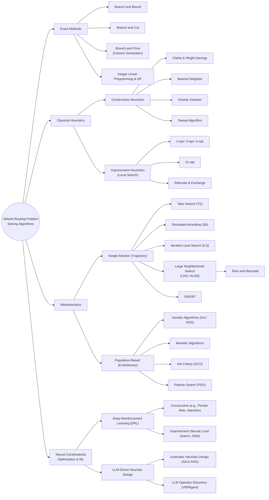

# Vehicle Routing Problem (VRP) Solving Algorithms

This document provides a structured taxonomy of the main algorithms used to solve the **Vehicle Routing Problem (VRP)** and its variants (e.g., CVRP, VRPTW, VRPPDTW, PCVRP). It categorizes methods from traditional exact mathematical models to classical heuristics, metaheuristics, Neural Combinatorial Optimization (NCO), and emerging LLM-driven heuristic designs.

---

## Algorithm Taxonomy (Hierarchical Left-to-Right Flowchart)

