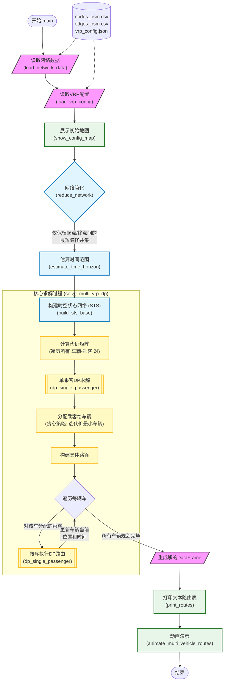

```mermaid
graph TD
    %% 定义样式
    classDef storage fill:#f9f,stroke:#333,stroke-width:2px;
    classDef process fill:#e1f5fe,stroke:#0277bd,stroke-width:2px;
    classDef logic fill:#fff9c4,stroke:#fbc02d,stroke-width:2px;
    classDef viz fill:#e8f5e9,stroke:#2e7d32,stroke-width:2px;

    Start([开始 main]) --> LoadNet[/"读取网络数据<br/>(load_network_data)"/]
    class LoadNet storage

    LoadNet --> LoadCfg[/"读取VRP配置<br/>(load_vrp_config)"/]
    class LoadCfg storage

    LoadCfg --> InitMap["展示初始地图<br/>(show_config_map)"]
    class InitMap viz

    InitMap --> Reduce{"网络简化<br/>(reduce_network)"}
    class Reduce process

    Reduce -->|仅保留起点/终点间的<br/>最短路径并集| EstTime["估算时间范围<br/>(estimate_time_horizon)"]
    class EstTime process

    EstTime --> BuildSTS["构建时空状态网络 (STS)<br/>(build_sts_base)"]
    class BuildSTS process
    
    subgraph CoreSolver ["核心求解过程 (solve_multi_vrp_dp)"]
        direction TB
        BuildSTS --> CostMatrix["计算代价矩阵<br/>(遍历所有 车辆-乘客 对)"]
        class CostMatrix logic
        
        CostMatrix --> DP1[["单乘客DP求解<br/>(dp_single_passenger)"]]
        class DP1 logic

        DP1 --> Assign["分配乘客给车辆<br/>(贪心策略: 选代价最小车辆)"]
        class Assign logic

        Assign --> BuildRoutes["构建具体路径"]
        class BuildRoutes logic

        BuildRoutes --> LoopVeh{遍历每辆车}
        
        LoopVeh -->|对该车分配的乘客| SeqDP[["按序执行DP路由<br/>(dp_single_passenger)"]]
        class SeqDP logic
        
        SeqDP -->|更新车辆当前<br/>位置和时间| LoopVeh
    end

    LoopVeh -->|所有车辆规划完毕| OutputData[/"生成解的DataFrame"/]
    class OutputData storage

    OutputData --> Print["打印文本路由表<br/>(print_routes)"]
    class Print viz

    Print --> Animate["动画演示<br/>(animate_multi_vehicle_routes)"]
    class Animate viz

    Animate --> End([结束])

    %% 数据文件标注
    Files[("nodes_osm.csv<br/>edges_osm.csv<br/>vrp_config.json")] -.-> LoadNet
    Files -.-> LoadCfg
```