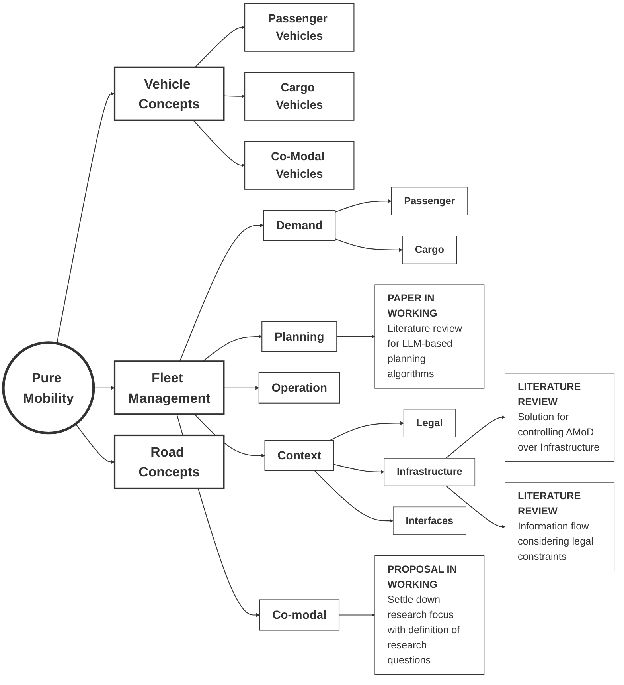

```mermaid
%%{init: {'theme': 'base', 'themeVariables': { 'background': '#ffffff', 'primaryColor': '#ffffff' }}}%%

graph LR
    %% Main Root
    Root((<b>Pure Mobility</b>))
    
    %% Level 1: Project break down
    Root --> Vehicle[<b>Vehicle Concepts</b>]
    Root --> Fleet[<b>Fleet Management</b>]
    Root --> Road[<b>Road Concepts</b>]


    %% Level 2: Vehicle Concepts Breakdown
    Vehicle --> V_Pax[<b>Passenger Vehicles</b>]
    Vehicle --> V_Car[<b>Cargo Vehicles</b>]
    Vehicle --> V_Co[<b>Co-Modal Vehicles</b>]

    %% Level 2: Fleet Management Breakdown
    Fleet --> F_Dem[<b>Demand</b>]
    Fleet --> F_Pl[<b>Planning</b>]
    Fleet --> F_Op[<b>Operation</b>]
    Fleet --> F_Con[<b>Context</b>]
    Fleet --> F_Co[<b>Co-modal</b>]


    %% Level 3: Demand breakdown
    F_Dem --> F_Dem_Pax[<b>Passenger</b>]
    F_Dem --> F_Dem_Cargo[<b>Cargo</b>]
    
    %% Level 3: Planning breakdown
    F_Pl --> F_Pl_LLM[<b>PAPER IN WORKING</b><br/>Literature review for LLM-based planning algorithms]

    %% Level 3: Context breakdown
    F_Con --> F_Con_Legal[<b>Legal</b>]
    F_Con --> F_Con_Infr[<b>Infrastructure</b>]
    F_Con --> F_Con_Inter[<b>Interfaces</b>]

    %% Level 3: Co-modal breakdown
    F_Co --> F_Co_Proposal[<b>PROPOSAL IN WORKING</b><br/>Settle down research focus with definition of research questions]


    %% level 4: Infrastructure breakdown
    F_Con_Infr --> F_Con_Infr_Contr[<b>LITERATURE REVIEW</b><br/>Solution for controlling AMoD over Infrastructure]
    F_Con_Infr --> F_Con_Infr_Fl[<b>LITERATURE REVIEW</b><br/>Information flow considering legal constraints]


    %% Styling for visual clarity
    classDef level1 fill:#fff,stroke:#333,stroke-width:6px,font-size:32px;
    classDef level2 fill:#fff,stroke:#333,stroke-width:4px,font-size:32px;
    classDef level3 fill:#fff,stroke:#333,stroke-width:2px,font-size:28px;
    classDef level4 fill:#fff,stroke:#333,stroke-width:1.5px,text-align:left,font-size:24px;
    classDef level5 fill:#fff,stroke:#333,stroke-width:1px,text-align:left,font-size:24px;

    class Root level1;
    class Vehicle,Fleet,Road level2;
    class V_Pax,V_Car,V_Co,F_Dem,F_Pl,F_Op,F_Con,F_Co level3;
    class F_Dem_Pax,F_Dem_Cargo,F_Pl_LLM,F_Con_Legal,F_Con_Infr,F_Con_Inter,F_Co_Proposal level4; 
    class F_Con_Infr_Contr,F_Con_Infr_Fl level5;

    %% Arrow (link) styling
    linkStyle default stroke:#333,stroke-width:2px;

```

