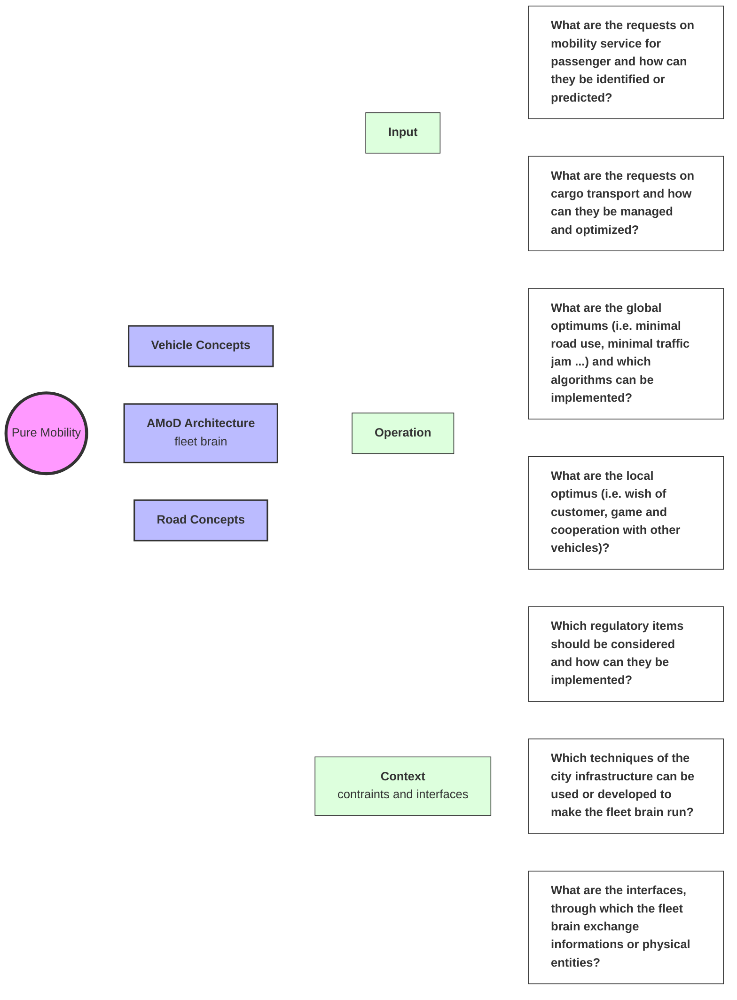

```mermaid
%%{init: {'theme': 'base', 'themeVariables': { 'background': '#ffffff', 'primaryColor': '#ffffff' }}}%%

graph LR
    %% Main Root
    Root((Pure Mobility))
    
    %% Level 1: Project break down
    Root --> Vehicle[<b>Vehicle Concepts</b>]
    Root --> AMoD[<b>AMoD Architecture</b><br/>fleet brain]
    Root --> Road[<b>Road Concepts</b>]


    %% Level 2: AMoD Breakdown
    AMoD --> A_In[<b>Input</b>]
    AMoD --> A_Op[<b>Operation</b>]
    AMoD --> A_Con[<b>Context</b><br/>contraints and interfaces]

    %% Level 3: Input research questions
    A_In --> A_In_Pax["<b>What are the requests on mobility service for passenger and how can they be identified or predicted?</b>"]
    A_In --> A_In_Cargo["<b>What are the requests on cargo transport and how can they be managed and optimized?</b>"]

    %% Level 3: Operation research questions
    A_Op --> A_Op_Global["<b>What are the global optimums (i.e. minimal road use, minimal traffic jam ...) and which algorithms can be implemented?</b>"]
    A_Op --> A_Op_Local["<b>What are the local optimus (i.e. wish of customer, game and cooperation with other vehicles)?</b>"]
    
    %% Level 3: Context research questions
    A_Con --> A_Con_Legal["<b>Which regulatory items should be considered and how can they be implemented?</b>"]
    A_Con --> A_Con_Infr["<b>Which techniques of the city infrastructure can be used or developed to make the fleet brain run?</b>"]
    A_Con --> A_Con_Inter["<b>What are the interfaces, through which the fleet brain exchange informations or physical entities?</b>"]


    %% Styling for visual clarity
    classDef main fill:#f9f,stroke:#333,stroke-width:4px;
    classDef pillar fill:#bbf,stroke:#333,stroke-width:2px;
    classDef sub fill:#dfd,stroke:#333,stroke-width:1px;
    classDef leaf fill:#fff,stroke:#333,stroke-width:1px,text-align:left;

    class Root main;
    class Vehicle,AMoD,Road pillar;
    class A_In,A_Op,A_Out,A_Con sub;
    class A_In_Pax,A_In_Cargo,A_Op_Global,A_Op_Local,A_Con_Legal,A_Con_Infr,A_Con_Inter leaf; 

    %% Arrow (link) styling
    %% NOTE: Since background is #ffffff, 'white' arrows will be invisible. 
    %% Change 'white' to another color like 'black' or '#ff0000' if needed.
    linkStyle default stroke:white,stroke-width:2px;

```

